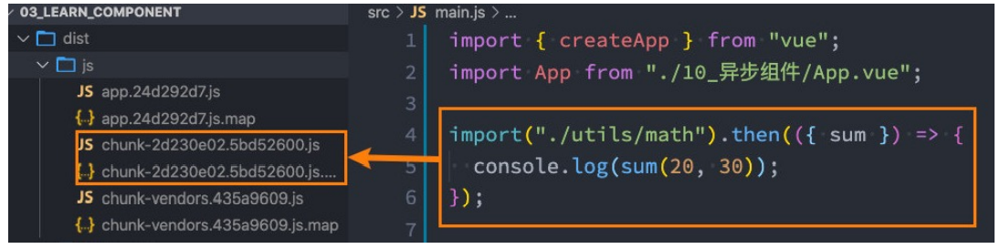

## 动态组件的实现

* 动态组件是使用component组件，通过一个特殊的attribute is来实现：
```vue
<template>
  <div>
    <button
      @click="changePage(item)"
      v-for="item in tabs"
      :key="item"
      :class="{ active: currentPage === item }"
    >
      {{ item }}
    </button>
    <component :is="currentPage"></component>
  </div>
</template>
```

* currentPage的值需要是什么内容呢

- 可以是通过component函数注册的组件；
- 在一个组件对象的components对象中注册的组件；

### 动态组件的传值


* 如果是动态组件可以给其传值和监听事件
- 只是需要将属性和监听事件放到component上来使用
```vue
<component :is="currentPage"
            name = "why"
            @pageClick = "pageClick"
            :age = "18"
/>
```

### 认识keep-alive

* 为了保持某个组件在被切换后不被销毁掉的时候，我们可以使用一个内置的组件；keep-alive
```vue
<keep-alive include="home,about">
    <component :is="currentPage"
                name = "why"
                @pageClick = "pageClick"
                :age = "18"
    />
</keep-alive>
```

### keep-alive属性

1. include - string | RegExp | Array 。只有名称匹配的组件会被缓存；
2. exclude - string | RegExp | Array . 任何名称匹配的组件都不会被缓存；
3. max - number | string。 最多可以缓存多少组件实例，一旦达到这个数字，那么缓存组件中最近没有被访问的实例会被销毁；

* include和exclude prop 允许组件有条件地缓存
- 二者都可以用逗号分割字符串、正则表达式或一个数组来表示；
- 匹配首先检查组件自身的name选项

```vue
<template>
    <keep-alive include = "a,b">
        <component :is = "view"></component>
    </keep-alive>
    <keep-alive :include = "/a|b/">
        <component :is = "view"></component>
    </keep-alive>
    <keep-alive :include = "['a', 'b']">
        <component :is = "view"></component>
    </keep-alive>
</template>
```

### 缓存组件的生命周期

* 对于缓存的组件，再次进入时，我们是不会执行created或者mounted等生命周期函数的

- 但是有时候我们确实希望监听到何时重新进入到了组件，何时离开了组件；
- 这个时候我们可以使用activated 和 deactivated 这两个生命周期钩子函数来监听；

```js
activated(){
    console.log("about activated")
},
deactivated(){
    console.log("about deactivated")
}
```

### webpack 的代码分包

* 默认的打包过程
  - 默认情况下，在构建整个组件树的过程中，因为组件和组件之间是通过模块化直接依赖的，那么webpack在打包时就会将组件模块打包到一起（比如一个app.js文件中）；
 -  这个时候随着项目的不断庞大，app.js文件的内容过大，会造成首屏的渲染速度变慢

* 打包时，代码的分包：
  - 所以，对于一些不需要立即使用的组件，我们可以单独对它们进行拆分，拆分成一些小的代码块chunk.js；
  - 这些chunk.js会在需要时从服务器加载下来，并且运行代码，显示对应的内容

* 那么webpack中如何可以对代码进行分包呢？



    利用异步组件的思想(按需加载)

### vue实现异步组件

* 如果我们的项目过大了，对于某些组件我们希望通过异步的方式来进行加载（目的是可以对其进行分包处理），那么Vue中给我们提供了一个函数：defineAsyncComponent
* defineAsyncComponent接受两种类型的参数：
  - 类型一：工厂函数，该工厂函数需要返回一个Promise对象
  - 类型二：接受一个对象类型，对异步函数进行配置

* 工厂函数类型一的写法：

```js
    import { defineAsyncComponent } from 'vue'
    import Loading from './Loading.vue'
    const AsyncCategory = defineAsyncComponent(() => import("./AsyncCategory.vue")) 
    components : {
        AsyncCategory,
        Loading
    }
```

* 二的写法：
```js
    const AsyncCategory = defineAsyncComponent({
        loader : () => import("./AsyncCategory.vue"),
        loadingComponent :  Loading,
        // errorComponent : 
        // 在显示loadingComponent组件之前，等待多长时间
        delay : 2000,
        /*
        * err : 错误信息
        retry : 函数，调用retry尝试重新加载
        attempts : 记录尝试的次数
        */ 
        onError : function(err, retry, attempts) {

        }
    }) 
```

### 异步组件和Suspense

* Suspense是一个内置的全局组件，该组件有两个插槽：
  - default : 如果default可以显示，那么显示default的内容；
  - fallback : 如果default无法显示，那么会显示fallback里面的内容

```vue
<template>
    <suspense>
        <template #default>
            <async-home></async-home>
        </template>
        <template #fallback>
            <loading />
        </template>
    </suspense>
</template>
```

### 组件的v-model

* v-model的双向绑定的处理
  - v-bind:value的数据绑定和@input的事件监听
* 在组件上使用v-model的时候，等价于如下的操作
  - 和input元素不同的只是属性的名称和事件触发的名称而已
```vue
<template>
    <my-input v-model="message" />
    <!-- 相当于 -->
    <my-input :model-value="message" @update:model-value="message = $event" />
</template>
```

### 组件v-model的实现

* MyInput组件可以正常的工作，这个组件内的 <input> 必须
  - 将其 value attribute 绑定到一个名叫 modelValue 的 prop 上；
  - 在其 input 事件被触发时，将新的值通过自定义的 update:modelValue 事件抛出

* MyInput.vue的组件代码如下:

```vue
<template>
    <div>
        <input :value = "modelValue" @input="inputChange" />
    </div>
</template>
<script>
    export default { 
        props : ["modelValue"],
        emits : ["update:modelValue"],
        methods : {
            inputChange(){
                this.$emit("update:modelValue", event.target.value)
            }
        }
    }
</script>
```

