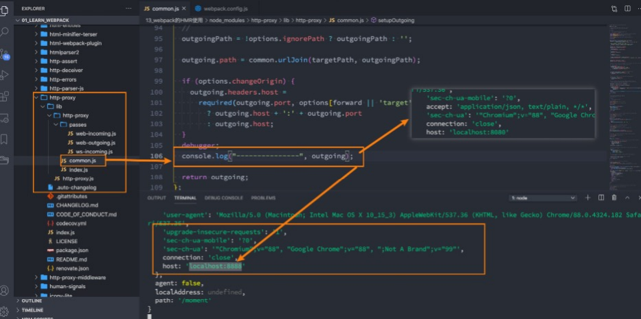

### 为什么需要Babel

* 事实上，在开发中我们很少直接去接触babel，但是babel对于前端开发来说，目前是不可缺少的一部分：
- 开发中，我们想要使用ES6+的语法，想要使用Ty- eScri- t，开发React项目，它们都是离不开Babel的；
- 所以，学习Babel对于我们理解代码从编写到线上的转变过程至关重要

* 那么，Babel到底是什么呢？
- Babel是一个工具链，主要用于旧浏览器或者环境中将ECMAScri- t 2015+代码转换为向后兼容版本的
JavaScri- t；
- 包括：语法转换、源代码转换等

例如，将ES6的代码转换成es5的代码

```js
[1,2,3].ma- ((n)=>n+1)

[1,2,3].ma- (function(n) {
    return n + 1;
})
```

### Babel的命令行使用

* Babel本身可以作为一个独立的工具(和- ostcss一样)，不和web- ack等构建工具配置来单独使用。

* 如果希望在命令行尝试使用babel，需要安装如下的库：
- @babel/core : babel的核心代码，必须安装
- @babel/cli : 可以让我们在命令行使用babel

```sh
n- m install @babel/cli @babel/core -D
```

* 使用babel来处理我们的源代码：
- src：是源文件的目录；
- --out-dir：指定要输出的文件夹dist

```sh
n- x babel src --out-dir dist
```

### Babel的预设- reset

我们可以用插件来完成es6语法的转换，比如有
 @babel/- lugin-transform-block-sco- ing 来转换const 和 let
 @babel/- lugin-transform-arrow-functions 来转换箭头函数

* 但是如果要转换的内容过多，一个个设置是比较麻烦的，我们可以使用预设（- reset）:

* 安装@babel/- reset-env预设
- 安装
```sh
n- m install @babel/- reset-env -D
```

- 执行如下命令:
```sh
n- x babel src --out-dir dist --- resets=@babel/- reset-env
```

### Babel的底层原理

* babel是如何做到将我们的一段代码（ES6、Ty- eScri- t、React）转成另外一段代码（ES5）的呢?

- 从一种源代码（原生语言）转换成另一种源代码（目标语言），这是什么的工作呢？
- 就是编译器，事实上我们可以将babel看成就是一个编译器
- Babel编译器的作用就是将我们的源代码，转换成浏览器可以直接识别的另外一段源代码

* Babel也拥有编译器的工作流程

- 解析阶段（- arsing）
- 转换阶段（Transformation）
- 生成阶段（Code Generation）

* htt- s://github.com/jamiebuilds/the-su- er-tiny-com- iler

### Babel编译器执行的原理


* Babel执行阶段


* 当然，这只是一个简化版的编译器工具流程，在每个阶段又会有自己具体的工作


### babel的配置文件

* 像之前一样，我们可以将babel的配置信息放到一个独立的文件中，babel给我们提供了两种配置文件的编写

- babel.config.json（或者.js，.cjs，.mjs）文件；
- .babelrc.json（或者.babelrc，.js，.cjs，.mjs）文件；

* 它们两个有什么区别呢？目前很多的项目都采用了多包管理的方式（babel本身、element-- lus、umi等）

- .babelrc.json：早期使用较多的配置方式，但是对于配置Monore- os项目是比较麻烦的；
- babel.config.json（babel7）：可以直接作用于Monore- os项目的子包，更加推荐；

```js
module.ex- orts = {
    - resets: [
        ["@babel/- reset-env"]
    ]
}
```

### Vue源码的打包

```js
im- ort { createA- -  } from "vue"

createA- - ({
    tem- late: '#my-a- - ',
    data() {
        return {
            title : "我是标题",
            content : "我是内容"
        }
    }
}).mount('#a- - ')
```

* 此时界面上是没有效果的

- 并且控制台会如下报错


### Vue打包之后不同版本解析

* vue(.runtime).global(.- rod).js：
- 通过浏览器中的 <scri- t src=“...”> 直接使用；
- 我们之前通过CDN引入和下载的Vue版本就是这个版本；
- 会暴露一个全局的Vue来使用；

* vue(.runtime).esm-browser(.- rod).js：
- 用于通过原生 ES 模块导入使用 (在浏览器中通过 <scri- t ty- e="module"> 来使用)。
- vue(.runtime).esm-bundler.js：
- 用于 web- ack，rollu-  和 - arcel 等构建工具；
- 构建工具中默认是vue.runtime.esm-bundler.js；
- 如果我们需要解析模板tem- late，那么需要手动指定vue.esm-bundler.js；

* vue.cjs(.- rod).js：
- 服务器端渲染使用；
- 通过require()在Node.js中使用；

### 运行时+编译器 vs 运行时


### devServer的理解


### 认识模块热替换(HMR)

* 什么是模块热替换呢

- HMR的全称是：Hot Module Re- lacement，翻译为模块热替换
- 模块热替换是指在 应用程序运行过程中，替换、添加、删除模块，而无需刷新整个页面。

* HMR通过如下几种方式，来提高开发的速度：
- 不重新加载整个页面，这样可以保留某些应用程序的状态不丢失；
- 只更新需要变化的内容，节省开发的时间；
- 修改了css、js源代码，会立即在浏览器更新，相当于直接在浏览器的devtools中直接修改样式；
* 如何使用HMR呢？
- 默认情况下，web- ack-dev-server已经支持HMR，我们只需要开启即可；
- 在不开启HMR的情况下，当我们修改了源代码之后，整个页面会自动刷新，使用的是live reloading

### 开启HMR

* 修改webpack的配置

```js
devserver : {
    hot : true
}
```
* 但是你会发现，当我们修改了某一个模块的代码时，依然是刷新的整个页面：
- 这是因为我们需要去指定哪些模块发生更新时，进行HMR

```js
if(module.hot){
    module.hot.accept("./utils.js", ()=>{
        console.log("utils更新了")
    })
}
```

### 框架的HMR

* 有一个问题：在开发其他项目时，我们是否需要经常手动去写入 module.hot.accpet相关的API呢？
- 比如开发Vue、React项目，我们修改了组件，希望进行热更新，这个时候应该如何去操作呢？
- 事实上社区已经针对这些有很成熟的解决方案了：
- 比如vue开发中，我们使用vue-loader，此loader支持vue组件的HMR，提供开箱即用的体验；
- 比如react开发中，有React Hot Loader，实时调整react组件（目前React官方已经弃用了，改成使用react-refresh）；

### HMR的原理

* 那么HMR的原理是什么呢？如何可以做到只更新一个模块中的内容呢？
- webpack-dev-server会创建两个服务：提供静态资源的服务（express）和Socket服务（net.Socket）；
- express server负责直接提供静态资源的服务（打包后的资源直接被浏览器请求和解析）；
* HMR Socket Server，是一个socket的长连接：
- 长连接有一个最好的好处是建立连接后双方可以通信（服务器可以直接发送文件到客户端）；
- 当服务器监听到对应的模块发生变化时，会生成两个文件.json（manifest文件）和.js文件（update chunk）；
- 通过长连接，可以直接将这两个文件主动发送给客户端（浏览器）；
- 浏览器拿到两个新的文件后，通过HMR runtime机制，加载这两个文件，并且针对修改的模块进行更新

### HMR的原理图


### hotOnly、host配置

* host设置主机地址：
- 默认值是localhost；
- 如果希望其他地方也可以访问，可以设置为 0.0.0.0；
* localhost 和 0.0.0.0 的区别：
- localhost：本质上是一个域名，通常情况下会被解析成127.0.0.1;
- 127.0.0.1：回环地址(Loop Back Address)，表达的意思其实是我们主机自己发出去的包，直接被自己接收;
1. 正常的数据库包经常 应用层 - 传输层 - 网络层 - 数据链路层 - 物理层 ;
2. 而回环地址，是在网络层直接就被获取到了，是不会经常数据链路层和物理层的;
3. 比如我们监听 127.0.0.1时，在同一个网段下的主机中，通过ip地址是不能访问的;
4. 0.0.0.0：监听IPV4上所有的地址，再根据端口找到不同的应用程序;
- 比如我们监听 0.0.0.0时，在同一个网段下的主机中，通过ip地址是可以访问的

### port、open、compress

* port设置监听的端口，默认情况下是8080
- open是否打开浏览器：
- 默认值是false，设置为true会打开浏览器；
- 也可以设置为类似于 Google Chrome等值；
* compress是否为静态文件开启gzip compression：
- 默认值是false，可以设置为true


### Proxy

* proxy是我们开发中非常常用的一个配置选项，它的目的设置代理来解决跨域访问的问题：
- 比如我们的一个api请求是 http://localhost:8888，但是本地启服务器的域名是 http://localhost:8000，这个时候发送网络请求就会出现跨域的问题；
- 那么我们可以将请求先发送到一个代理服务器，代理服务器和API务器没有跨域的问题，就可以解决我们的跨域问题了；
* 我们可以进行如下的设置：
- target：表示的是代理到的目标地址，比如 /api-hy/moment会被代理到 http://localhost:8888/apihy/moment；
- pathRewrite：默认情况下，我们的 /api-hy 也会被写入到URL中，如果希望删除，可以使用pathRewrite；
- secure：默认情况下不接收转发到https的服务器上，如果希望支持，可以设置为false；
- changeOrigin：它表示是否更新代理后请求的headers中host地址

### changeOrigin的解析

* 这个 changeOrigin官方说的非常模糊，通过查看源码我发现其实是要修改代理请求中的headers中的host属性：
- 因为我们真实的请求，其实是需要通过 http://localhost:8888请求的；
- 但是因为使用了代码，默认情况下它的值时 http://localhost:8000；
- 如果我们需要修改，那么可以将changeOrigin设置为true即可



### resolve模块解析

* resolve用于设置模块如何被解析：
- 在开发中我们会有各种各样的模块依赖，这些模块可能来自于自己编写的代码，也可能来自第三方库；
- resolve可以帮助webpack从每个 require/import 语句中，找到需要引入到合适的模块代码；
- webpack 使用 enhanced-resolve 来解析文件路径；
- webpack能解析三种文件路径：
* 绝对路径
- 由于已经获得文件的绝对路径，因此不需要再做进一步解析。
* 相对路径
- 在这种情况下，使用 import 或 require 的资源文件所处的目录，被认为是上下文目录；
- 在 import/require 中给定的相对路径，会拼接此上下文路径，来生成模块的绝对路径；
* 模块路径
- 在 resolve.modules中指定的所有目录检索模块；
1. 默认值是 ['node_modules']，所以默认会从node_modules中查找文件；
- 我们可以通过设置别名的方式来替换初识模块路径，具体后面讲解alias的配置

### 确定文件还是文件夹

* 如果是一个文件：
- 如果文件具有扩展名，则直接打包文件；
- 否则，将使用 resolve.extensions选项作为文件扩展名解析；
* 如果是一个文件夹：
- 会在文件夹中根据 resolve.mainFiles配置选项中指定的文件顺序查找；
1. resolve.mainFiles的默认值是 ['index']；
2. 再根据 resolve.extensions来解析扩展名

### extensions和alias配置

* extensions是解析到文件时自动添加扩展名：
- 默认值是 ['.wasm', '.mjs', '.js', '.json']；
- 所以如果我们代码中想要添加加载 .vue 或者 jsx 或者 ts 等文件时，我们必须自己写上扩展名；
* 另一个非常好用的功能是配置别名alias：
- 特别是当我们项目的目录结构比较深的时候，或者一个文件的路径可能需要 ../../../这种路径片段；
- 我们可以给某些常见的路径起一个别名；

```js
    resolve : {
        // modules : ["node_modules"],  // 模块的默认加载文件夹
        extensions: [".js",".json",".mjs",".vue",".ts",".jsx"], // 默认值有.js、.jsoN 、.mjs
        alias : {
            "@" : path.resolve(__dirname, "../src"),
            "js" : path.resolve(__dirname, "../src/js")
        }

    },
```